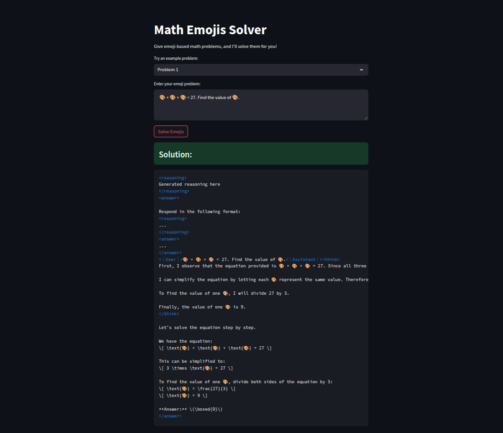

# DeepSeek R1 Math Emoji Problem Solver

An interactive web application that solves mathematical problems written with emojis using a fine-tuned DeepSeek-R1 language model with GRPO (Group Relative Policy Optimization). This custom-trained model specializes in solving creative mathematical equations represented by emojis.



For a detailed step-by-step guide on how this model was fine-tuned, check out the [blog post](https://medium.com/@saadsohail5104/finetuning-deepseek-r1-using-grpo-for-emoji-math-with-unsloth-a-step-by-step-guide-dac9e47ab9c9).

## Model Details

- Base Model: DeepSeek-R1
- Fine-tuning Method: GRPO (Group Relative Policy Optimization)
- Specialization: Emoji-based mathematical problem solving
- Training Data: Diverse set of emoji mathematical equations and their solutions

## Features

- Solve emoji-based math equations
- Pre-loaded example problems
- Interactive Streamlit interface   
- Powered by DeepSeek language model

## Installation

1. Clone the repository:
```bash
git clone https://github.com/saadsohail05/DeepSeek-R1-Creative-Math-Problem-Solver.git
cd DeepSeek-R1-Creative-Math-Problem-Solver
```

2. Install dependencies:
```bash
pip install -r requirements.txt
```

## Usage

1. Run the Streamlit app:
```bash
streamlit run app_emoji.py
```

2. Open your browser and navigate to the provided URL (typically http://localhost:8501)

3. Either select an example problem or enter your own emoji math problem

4. Click "Solve Emojis" to get the solution

## Example Problems

- 🎨 + 🎨 + 🎨 = 27
- 🐉 + 🐉 + 🐉 + 🐉 = 28
- 🎁 + 🎀 = 14, and 🎁 - 🎀 = 2

## Project Structure

- `app_emoji.py`: Main Streamlit application
- `requirements.txt`: Project dependencies
- `DeepSeekR1-GRPO-CreativeMathProblemSolver.ipynb`: Model training notebook
- `inference_notebook_emoji.ipynb`: Inference demonstration notebook
- `data3.csv`: Training data
